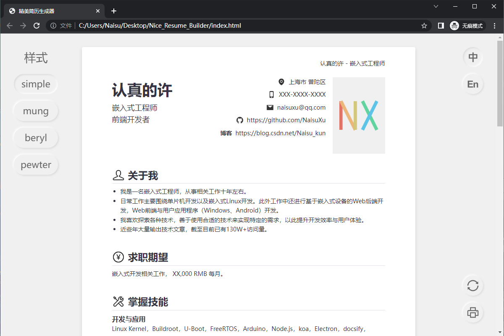

# 精美简历生成器


## 简介
这是一个使用JSON格式数据生成简历的工具，可一键切换中英文与主题样式，非开发者也可轻松上手使用。

市面上同类的使用JSON数据生成简历的工具不少，该工具相比大多数同类产品最大的优势是自动以一个个A4页面进行排版渲染，所见即所得。


## 使用方法
### 预览

双击打开项目目录下 **index.html** 文件就可以在浏览器中预览简历。简历最终是通过浏览器进行渲染呈现的，不同浏览器渲染上可能存在差异，推荐使用Chrome浏览器进行预览。




### 编辑

编辑 **resume** 目录下 **resume-json-zh.js** 和 **resume-json-en.js** 文件中内容即可修改简历，前者为中文简历，后者为英文简历。前述文件中已经包含了详细的注释说明（ `//` 及其后面所有文本为注释信息，不会参与实际简历生成，可以删除）。


可以使用 **记事本** 等软件打开前述文件进行修改，修改后保存文件，然后点击预览页面中右下角刷新按钮即可看到修改后的效果。（使用 [Visual Studio Code](https://code.visualstudio.com/) 代替 记事本 进行文本修改会获得更好的编辑体验。）


到目前位置已经可以完整使用该工具了，如果使用中存在问题可以再接着往下看。


JSON格式数据主要就是以 **键值对** 的形式存在，主要有下面一些形式：

```javascript
"key": 0(number),
"key": false(or true),
"key": "text",
"key": [],
"key": {},
```

我们主要使用后面三种形式。 `Key` 只能使用文档中提供的那些， `text` `[]` `{}` 内容可以自行添加与修改。后两者是可以嵌套使用的，比如下面这样：

```javascript
"key": {
    "k1": {
        "kA": "text1",
        "kB": "text2"
    },
    "k2": [
        "ki": "text3",
        "kii": "text4",
        "kiii": "text5"
    ]
}
```

需要注意的是这里出现的 `"` `:` `,` 符号都得使用英文标点，每一个键值对结尾需要有 `,` （ `[]` `{}` 中最后一行不需要）。 


`text` 内容可以任意填写，但不能出现换行符等，如果需要换行可以使用 `<br>` ，该内容会被浏览器解读为换行符；如果需要使用英文的 `"` 需要使用 `\"` 的形式；文本首位或是中间出现的多个空格可能会被折叠，需要使用 `&nbsp;` 来表示一个半角的空格，或是使用 `&emsp;` 来插入全角空格。


该工具设计的目的是为了省去排版工作，不过有些时候可能还需要手动进行调整，可以灵活运用前面提到的换行和空格功能来调整。


## 已知的问题

在有些浏览器中打印时最后会出现一个空白页面，可以在打印时手动选择打印页面范围进行处理。


## 许可
该项目基于MIT许可，具体内容详见LICENSE文件。

